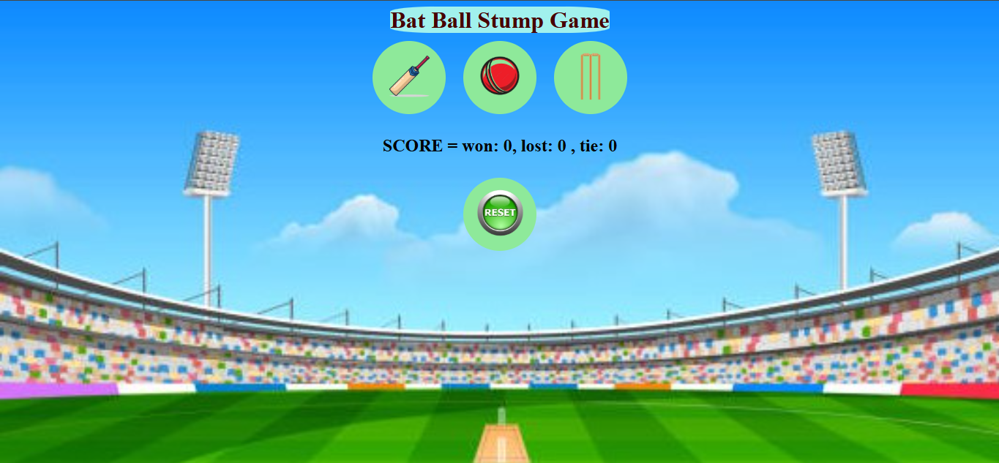
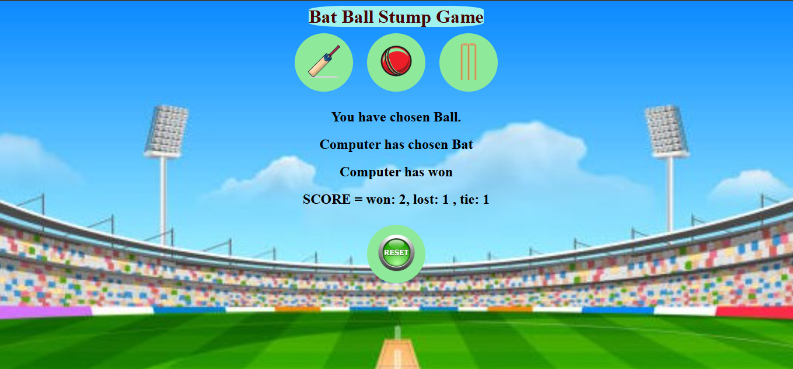

<h1>CRICKET GAME</h1>
This is a basic cricket game made using Javascript,html and css

The basic rules of this game are: you simply have to choose your choice as bat, ball or stump

<li>
  <ul>
    If chosen bat: you win only if the computer chooses ball, and you lose if the computer chooses stump, tie=if both chooses bat.
  </ul>
  <ul>
    If chosen ball:you win only if the computer chooses stump, and you lose if the computer chooses bat, tie=if both chooses ball.
  </ul>
  <ul>
    If  chosen stump:you win only if the computer chooses bat, and you lose if the computer chooses ball, tie-if both chooses stump.
  </ul>
</li>
<h5>Once you click on refresh, the game restarts!</h5>
<big>Some screenshots of the game</big>

<h2>Thank you for checking this out! Hope you guys had fun!!</h2>
